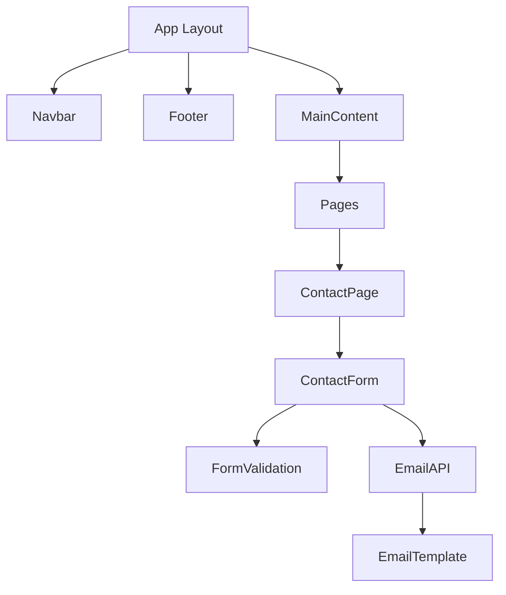

# System Patterns

## Architecture

- Next.js 15 App Router with React Server Components
- Hybrid rendering strategy:
  - SSG for content pages (projects, activities, books)
  - SSR for dynamic pages (contact form, resume)
  - ISR for frequently updated content
- API routes handling:
  - Email sending via Resend
  - Static data validation
  - CORS-protected endpoints
- Three-tier architecture:
  - Presentation (Components)
  - Application Logic (Hooks/Utils)
  - Data (API routes + external services)

## Key Technical Decisions

- TypeScript for type safety
- Tailwind CSS for styling
- shadcn/ui for base components
- React Hook Form for form management
- Zod for form validation
- Resend for email sending

## Component Relationships

