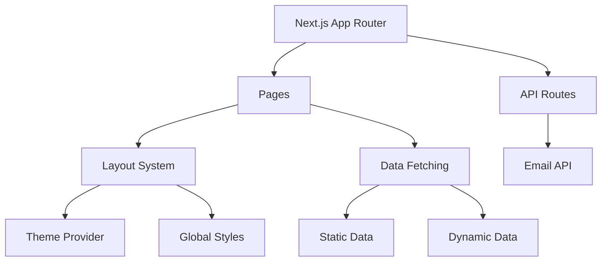

# System Patterns

## Architecture Overview


## Key Design Patterns
1. Atomic Component Design
   - Atoms: Basic UI elements (buttons, inputs)
   - Molecules: Combined atoms (forms, cards)
   - Organisms: Complex components (navbars, footers)

2. Data Flow
   - Static data through TS files
   - Dynamic data through API routes
   - Client-side state with React hooks
   - Form state with React Hook Form

3. Styling Approach
   - Tailwind utility classes
   - Component variants with clsx
   - Theme support through next-themes
   - Animation with tailwindcss-animate

4. API Patterns
   - RESTful endpoints
   - Type-safe request/response
   - Rate limiting
   - Email integration through Resend

## Component Relationships
```mermaid
flowchart TD
    Layout --> Navbar
    Layout --> Footer
    Layout --> ThemeProvider
    Page --> ActivityCard
    Page --> BookCard
    Page --> ProjectCard
    ContactPage --> ContactForm
    ContactForm --> Validation
