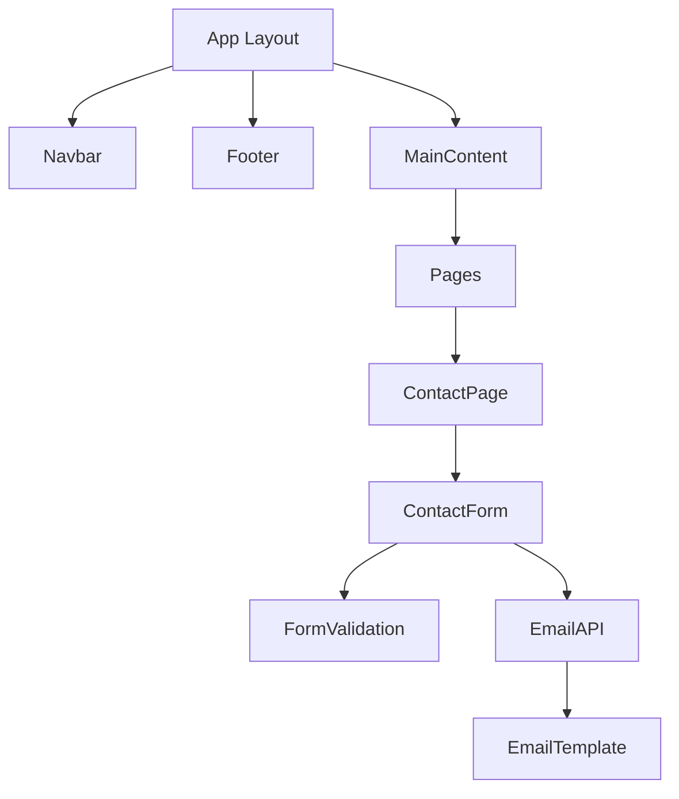

# System Patterns

## Architecture

- Next.js App Router architecture
- Server-side rendering for static pages
- Client-side rendering for interactive components
- API routes for backend functionality

## Key Technical Decisions

- TypeScript for type safety
- Tailwind CSS for styling
- shadcn/ui for base components
- React Hook Form for form management
- Zod for form validation
- Resend for email sending

## Component Relationships

