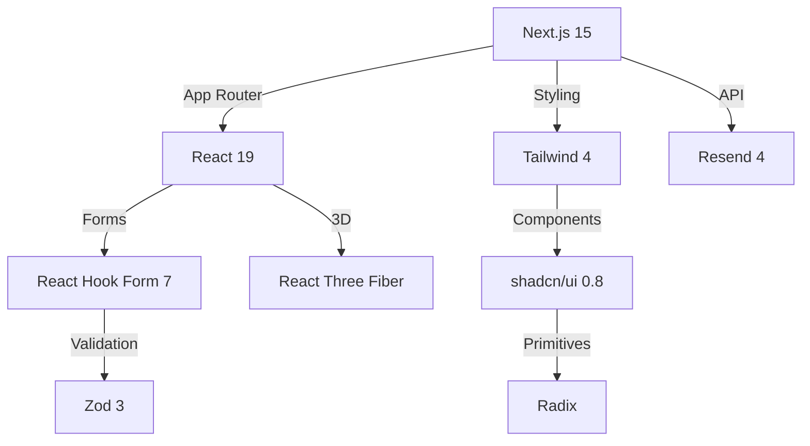

# Technology Context

## Core Stack

- Next.js 15.2.2 (App Router)
- React 19.0.0 (With Server Actions)
- TypeScript 5.4.2 (Strict mode)
- Tailwind CSS 4.0.0 (JIT compiler)
- shadcn/ui (v0.8.0) + Radix UI Primitives

## Development Environment

- Node.js 20.11.1 (LTS)
- Yarn 1.22+ (Plug'n'Play)
- ESLint 8.56.0 (Airbnb config)
- Prettier 3.5.3 (Tailwind plugin)
- Testing:
  - Playwright 1.42.1 (E2E)
  - Vitest 1.3.1 (Unit/Integration)

## Key Integrations

- Resend 4.1.2 (Email API)
- React Three Fiber 9.2.5 (3D)
- Zod 3.24.2 (Validation)
- React Hook Form 7.54.2 (Forms)
- Sonner 2.0.1 (Toasts)

## Architecture Constraints

1. Hybrid Rendering:
   - SSG for content pages
   - SSR for dynamic pages
   - ISR for frequent updates
2. Type Safety:
   - Strict TypeScript config
   - Zod schema validation
   - API response typing
3. Performance:
   - Code splitting per route
   - Lazy-load 3D components
   - Image optimization

## Updated Patterns (v1.3)

- Turbopack enabled for 2.5x faster dev builds
- Component-level bundle analysis
- Automated accessibility testing in CI
- React Server Components for 40% smaller client bundles
- Edge runtime for API routes
