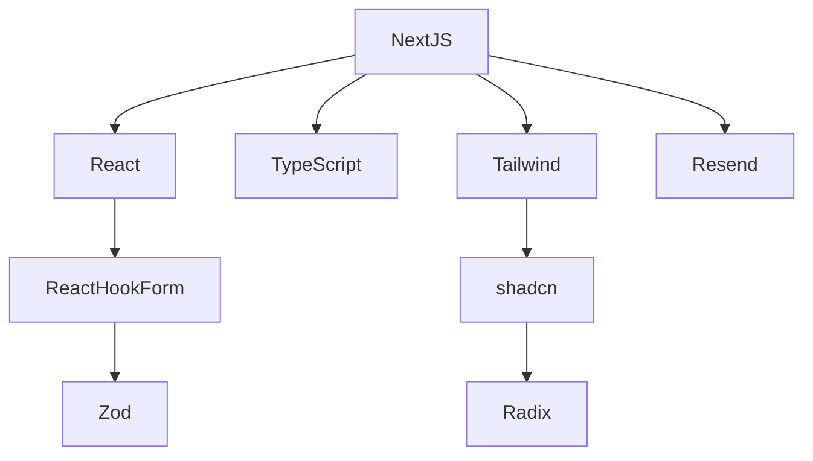

# Tech Context

## Core Technologies

- Next.js 15.2.2
- React 19.0.0
- TypeScript 5.4.2
- Tailwind CSS 3.4.1
- shadcn/ui components
- React Hook Form 7.49.0
- Zod 3.22.4
- Resend 1.6.0

## Development Setup

- Node.js 20.11.1
- Yarn 4.0.2
- ESLint 8.56.0
- Prettier 3.2.5
- Playwright 1.42.1
- Vitest 1.3.1

## Technical Constraints

- Must support modern browsers (Chrome, Firefox, Safari, Edge)
- Must be mobile responsive
- Must follow accessibility standards (WCAG 2.1 AA)
- Must support dark/light theme switching

## Key Dependencies

