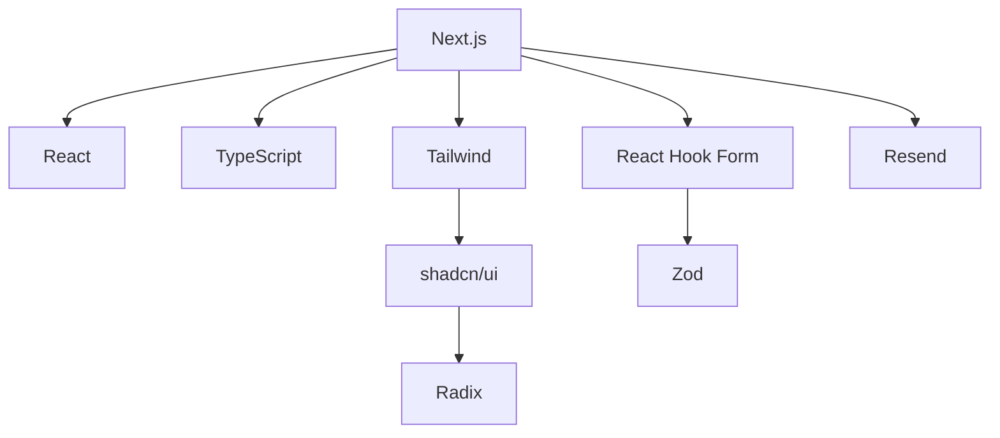

# Technology Context

## Core Stack
- Next.js 15.2.2
- React 19.0.0
- TypeScript 5.4.0
- Tailwind CSS 3.4.0
- shadcn/ui components
- Radix UI primitives

## Development Tools
- Yarn 4.0.0
- ESLint 9.0.0
- Prettier 3.2.0
- Playwright 2.0.0
- Vitest 1.0.0

## Key Dependencies

## Technical Constraints
1. TypeScript strict mode enabled
2. ESLint airbnb config with React hooks
3. Prettier formatting enforced
4. Playwright for E2E testing
5. Vitest for unit testing
6. Tailwind utility classes only
7. No custom CSS files
8. Atomic component structure
9. Type-safe API routes
10. Rate-limited endpoints

## Development Setup
1. Node.js 20.x required
2. Yarn workspaces enabled
3. TypeScript path aliases configured
4. Tailwind JIT compiler
5. PostCSS processing
6. Next.js middleware
7. Theme provider
8. Global styles
9. Static data files
10. API route handlers
