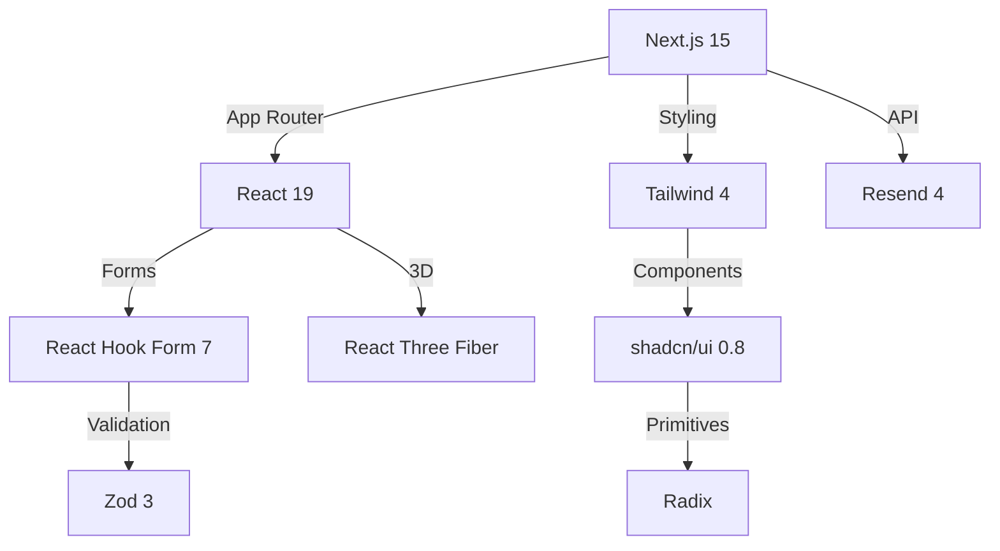

# Technology Context

## Core Stack

- Next.js ^15.2.2 (App Router)
- React ^19.0.0 (With Server Actions)
- TypeScript ^5 (Strict mode)
- Tailwind CSS ^4 (JIT compiler)
- shadcn/ui (CLI-managed, based on v0.8.0) + Radix UI Primitives (various ^1.1.x versions)

## Development Environment

- Node.js ^20 (LTS)
- Yarn 1.22+ (Used for package management)
- Prettier ^3.5.3 (with prettier-plugin-tailwindcss ^0.6.11)
- Testing (Planned, not yet installed):
  - Playwright (E2E)
  - Vitest (Unit/Integration)
- ESLint (Planned, not yet installed)

## Key Integrations & Libraries

- Resend ^4.1.2 (Email API)
- React Three Fiber ^9.1.0 + Three ^0.174.0 (3D)
- Zod ^3.24.2 (Validation)
- React Hook Form ^7.54.2 (Forms)
- Sonner ^2.0.1 (Toasts)
- Lucide React ^0.479.0 (Icons)
- Next Themes ^0.4.6 (Theme management)
- Class Variance Authority ^0.7.1 (Styling variants)
- clsx ^2.1.1 (Conditional classnames)
- Tailwind Merge ^3.0.2 (Merging Tailwind classes)
- TailwindCSS Animate ^1.0.7 (Animations)
- Radix UI components (Label ^2.1.2, Slot ^1.1.2, Tabs ^1.1.3, Toast ^1.2.6, Tooltip ^1.1.8)
- Hookform Resolvers ^4.1.3 (Zod resolver for React Hook Form)

## Architecture Constraints

1. Hybrid Rendering:
   - SSG for content pages
   - SSR for dynamic pages
   - ISR for frequent updates
2. Type Safety:
   - Strict TypeScript config
   - Zod schema validation
   - API response typing
3. Performance:
   - Code splitting per route
   - Lazy-load 3D components
   - Image optimization

## Updated Patterns (v1.3)

- Turbopack enabled for 2.5x faster dev builds
- Component-level bundle analysis
- Automated accessibility testing in CI
- React Server Components for 40% smaller client bundles
- Edge runtime for API routes
